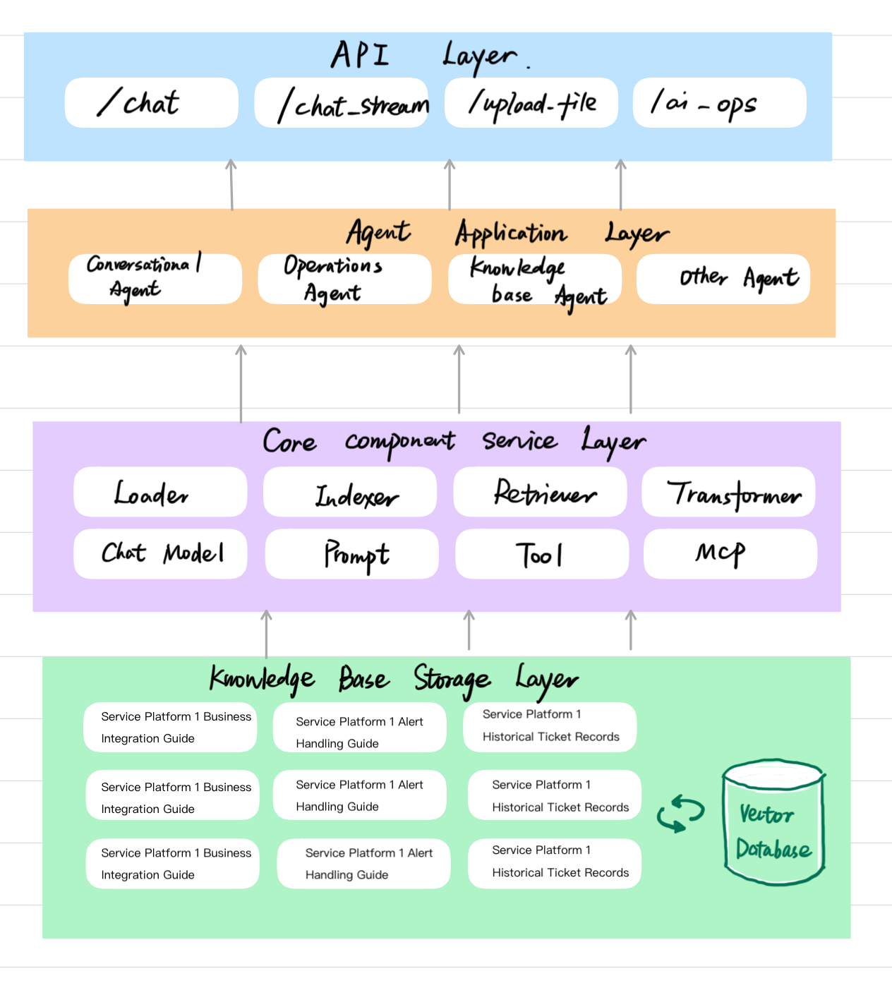
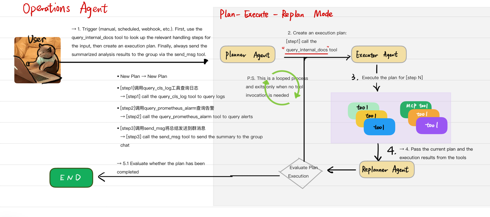
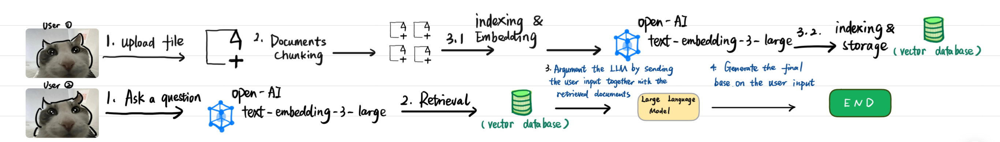
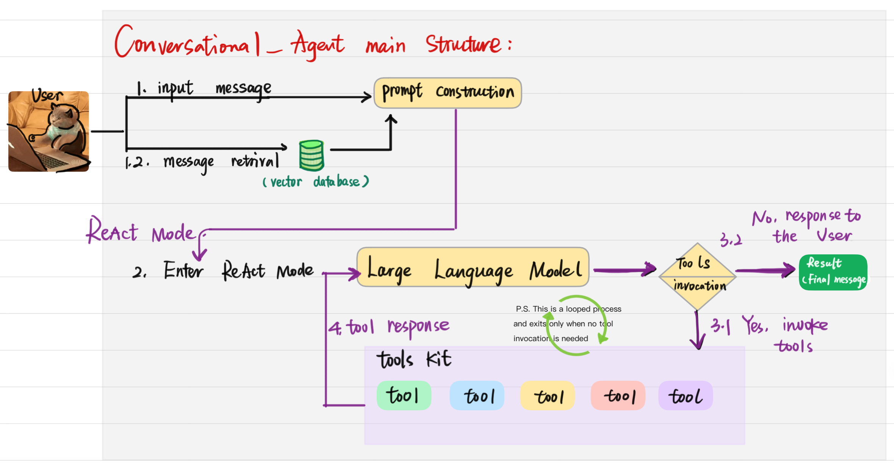
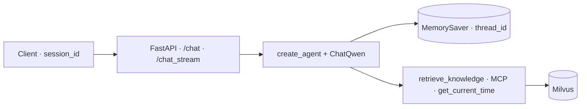

# AIOps—Pilot

**Intelligent incident response** — an autonomous AIOps agent framework that automates IT operations using a **Plan–Execute–Replan** loop and **LangGraph**. The agent does more than answer questions: it behaves as a digital SRE that can diagnose and troubleshoot failures with structured reasoning and tool use.

## System architecture (overview)

*End-to-end stack (bottom to top): **knowledge sources** and a **vector database** feed the **core layer** (document load/index, retrieval, chat model, prompts, tools, MCP). **Agent-style applications** (conversational chat, AIOps diagnosis, RAG-backed knowledge use) sit on that core and are exposed through the **API layer**.*

Typical HTTP entrypoints in this repo include **`POST /chat`**, **`POST /chat_stream`**, **`POST /upload`** (and **`POST /index_directory`** for batch indexing), and **`POST /aiops`** for the diagnostic workflow.



---

## Key architectural features

### 1. Cognitive architecture: Plan–Execute–Replan

Unlike a linear RAG-only pipeline, this project uses a **stateful cyclic graph**.

- **Strategic planning** — The `Planner` turns vague alerts into an ordered list of executable steps (a structured plan rather than a single free-form reply).
- **Autonomous execution** — The `Executor` invokes local tools and **MCP (Model Context Protocol)** clients to reach live signals (logs, metrics, traces) where your stack exposes them.
- **Self-correction** — The `Replanner` evaluates outcomes. If a step fails or the observation does not match expectations, the graph can **replan** instead of stopping at the first error.

*Plan–Execute–Replan flow (Planner → Executor → tools → Replanner → evaluate → loop or END):*



### 2. Knowledge retrieval (RAG)

- **Vector store** — **Milvus** backs semantic search over SOPs, runbooks, and post-mortems.
- **Ingestion** — Documents under the upload area are split and indexed; typical sources include `.md` and `.txt` operational manuals.

*RAG overview: ingestion (chunk → embed → store) and query-time retrieval (embed question → search vector store → augment the LLM):*



### 3. Conversational agent, observability, and streaming

The product exposes **two complementary surfaces**: an **alert-driven AIOps** workflow (Plan–Execute–Replan, see above) and a **conversational RAG agent** for interactive Q&A. This section focuses on the **chat agent** and how it is observed over the wire.

#### Conversational RAG agent — role and features

- **Purpose** — A **tool-augmented chat agent** (`RagAgentService`) answers questions in context: it can **retrieve** indexed knowledge, call **MCP-backed** capabilities, and hold a **multi-turn** dialogue per client session.
- **Runtime** — Built with LangChain **`create_agent`**, **ChatQwen**, and a LangGraph **`MemorySaver`** checkpointer. The model decides **when** to call tools; answers are grounded by **`retrieve_knowledge`** (Milvus) and extended by **MCP tools** loaded at startup, plus utilities such as **`get_current_time`**.
- **Session semantics** — The client supplies a **`session_id`**; it is mapped to LangGraph’s **`thread_id`**, so each session has **isolated** checkpointed state. Helpers expose **session history** and **clear-session** behavior on top of the same checkpointer.
- **Delivery modes** — **`POST /chat`** returns one JSON payload with the full reply. **`POST /chat_stream`** streams **SSE** so the UI can render **token-level** output and structured event types (e.g. **content**, **done**, **error**; the API layer can also forward **tool_call** / **search_results**-style events when present in the stream).

#### Streaming across the product

- **Chat** — SSE gives **low-latency** feedback for long answers and keeps the channel open for structured events alongside raw text.
- **AIOps** — **`POST /aiops`** uses SSE to push **diagnostic lifecycle** updates (e.g. status, plan, step completion, final summary), analogous in spirit to chat streaming but tied to the diagnostic graph rather than free-form dialogue.

#### Architecture (conversational path)

*High-level flow: user input and **RAG retrieval** (vector store) feed **prompt construction**; the LLM runs in a **ReAct** loop—**reason**, optionally **invoke tools** (local + MCP), feed **tool results** back into the model, and **exit** when no further tool calls are needed, then return the final message.*



*Service wiring (FastAPI session → agent → checkpointer → tools → Milvus):*



---

## Tech stack

| Area | Technology |
| :--- | :--- |
| **LLM orchestration** | LangGraph, LangChain |
| **LLM** | Qwen (via Alibaba Cloud DashScope / `langchain-qwq`) |
| **Vector store** | Milvus |
| **API** | FastAPI, SSE-Starlette |
| **Tooling protocol** | MCP (Model Context Protocol) |
| **Logging** | Loguru |

---

## Project layout

```text
├── app/
│   ├── agent/
│   │   ├── aiops/              # LangGraph nodes: planner, executor, replanner, state
│   │   └── mcp_client.py       # MCP integration
│   ├── services/               # Orchestration, RAG agent, embeddings, indexing pipeline
│   ├── api/                    # REST and SSE endpoints
│   ├── core/                   # Shared infrastructure (e.g. Milvus client)
│   ├── models/                 # Pydantic request/response models
│   ├── vector_index_service.py # Manual / directory indexing entrypoints
│   ├── vector_search_service.py
│   └── rag_agent_service.py
├── uploads/                    # Ops manuals and docs for RAG ingestion
└── main.py                     # Application entrypoint (if present in your deployment)
```

Adjust paths if your fork moves services under a different package layout.

---

## Getting started

### Prerequisites

- Python 3.10+
- Docker (recommended for Milvus standalone)

### Installation

1. **Clone the repository**

   ```bash
   git clone https://github.com/your-username/aiops-pilot.git
   cd aiops-pilot
   ```

2. **Environment**

   Create a `.env` file (names may vary; align with `app.config` in your tree):

   ```env
   DASHSCOPE_API_KEY=your_key_here
   MILVUS_HOST=localhost
   MILVUS_PORT=19530
   ```

3. **Install dependencies and run**

   ```bash
   pip install -r requirements.txt
   python main.py
   ```

   If you use Uvicorn directly, point it at your FastAPI application module as defined in your project.

---

## Example scenario

1. **Trigger** — An alert arrives: *High CPU usage on DB-01*.
2. **Retrieve** — The agent queries the vector index for runbooks matching “high CPU database”.
3. **Plan** — The planner emits steps such as: inspect top processes → inspect slow queries → inspect connection pool.
4. **Execute** — The executor runs tools (e.g. log or metrics queries via MCP or local adapters).
5. **Replan** — If new evidence appears (e.g. deadlock), the replanner updates the plan (e.g. targeted process or session actions).
6. **Report** — A concise root-cause and remediation summary is produced for operators.

---

## System design notes

These choices are intentional trade-offs, not accidental defaults.

### Why L2 (Euclidean) distance in Milvus?

Search is configured with **L2** on the embedding vectors. For dense embeddings trained with cosine-style geometry, L2 on **normalized** vectors is closely related to angular distance; Milvus optimizes ANN search for common metric types including L2. The scores returned are distances — **lower is more similar** — which keeps ranking semantics straightforward for debugging and for thresholding in ops workflows.

### Why structured output (Pydantic) for the planner?

The planner’s plan is modeled as a **typed schema** (e.g. a list of steps) rather than unconstrained prose. That yields:

- **Deterministic downstream behavior** — The executor consumes a list of steps, not a blob of text that must be reparsed.
- **Validation at the boundary** — Invalid or empty plans fail fast instead of corrupting the graph state.
- **Easier testing** — You can assert on structured plans in unit and integration tests.

Together, fixed retrieval metrics and structured planning outputs make the agent easier to reason about in production than a fully free-form “vibe-only” chain.

---

## License

Distributed under the MIT License. See the `LICENSE` file in the repository for full text.
